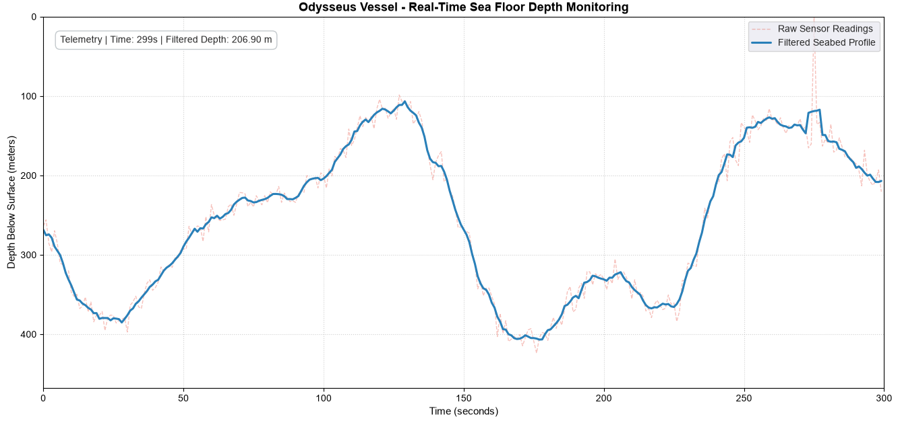
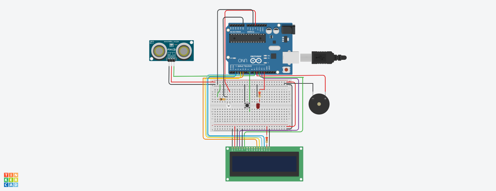

# SEDS BPHC — Avionics Round 1 Induction
**Project:** Athena's Intern (Project Odysseus)  
**Author:** Saptarshi Nandi  
**BITS ID:** [2026A4PS0609H]  

---

Hi, my name's Saptarshi. I'm very interested in space tech cuz I believe it's the pinnacle of human engineering.... now... what all I have experienced while doing the Avionics tasks...
first of all... I got to know how amazing TinkerCAD is... and also that it's not as formidable to understand if you have help(AI btw ... but still...). I had completed the python task with the help of AI relatively faster than the TinkerCAD task since I have an idea about python but I still had to install the matplotlib , numpy and pandas into my IDLE python version and set it to PATH in my Windows and whatnot since what I had was apparently the kiddy version of python. That was kinda exciting... since it always gives you a sense of accomplishment after you've managed to solve smth that had been giving you trouble(the modules were refusing to upload so I had to do some Windows + R stuff and typed shi in...). Now... regarding my experiences in Task 2... they were a bit of a roller coaster ride... I made the connections and wiring relatively easily as compared to the coding part.... the coding part i read thru once and I WILL be studying it in more detail after this too.... since I'm a total newbie to C++. But the pushbutton and light readings weren't working as I wanted them to(Or I THOUGHT I wanted them to...) after spending a ginormous amount of time trying to figure out what the problem was(could have done the structural part in the spent amount of time btw).... I finally realised that it was just a simulation error in my computer after I sat down one last time with a friend.... imagine my relief and anguish at that time lol... 
Lastly... I would like to say... that the induction tasks did help me learn new things and I'm kinda happy that I have the experience since I didn't even know TinkerCAD and all existed...Thanks a lot for this amazing experience....

(Btw the next part is AI written since I wanted it to give a better idea on hwo stuff worked... I have a basic idea abt it too... but I felt that it would write it better.)

## Overview
This repository contains the source code, implementation details, and circuit schematics for the SEDS BPHC Avionics Subsystem Round 1 Induction Tasks.

---

## Task 1: Finding the Sea Floor

### Approach & Implementation
1. **Data Ingestion & Formatting:** Loaded the telemetry time-series dataset using Pandas. Handled non-numeric strings (`#VALUE!` at Point 97) safely using `pd.to_numeric(errors='coerce')` and mapped negative depth coordinates to positive scalar values representing distance below the sea surface.
2. **Outlier Filtering (Point 151 Glitch):** The -1271.1 m sensor spike was detected using a 7-point rolling median with a 3-standard-deviation ($3\sigma$) threshold filter. Corrupted points were replaced with NaN and bridged using linear interpolation.
3. **Noise Reduction:** Applied a 5-point rolling moving average filter to smooth random high-frequency acoustic sensor jitter while preserving true seabed bathymetry.
4. **Real-Time Telemetry Animation:** Rendered an animated bathymetric graph updating at 1 Hz ($1000\text{ ms}$ interval) using `matplotlib.animation.FuncAnimation`, with an inverted Y-axis (sea surface at $0\text{ m}$) and a live telemetry HUD.

### Telemetry Graph

---

## Task 2: Keeping Watch Over Odysseus

### System Architecture & State Machine
The onboard safety system was designed in TinkerCAD Circuits using an Arduino Uno, 16x2 LCD screen(I would have tried I2C... but somehow it wasn't powering on... dunno why), 3-pin Ping ultrasonic sensor, ambient light sensor (LDR), push button, alert LED, and piezo buzzer.

The system runs a non-blocking Finite State Machine (FSM) utilizing `millis()`:
* **OPEN SEA:** Default navigation state; vessel sails safely.
* **ANCHOR DROPPED:** Push button toggles anchor state with 50 ms software debouncing. While anchored, danger timers are reset, and the vessel is fully protected from environmental hazards.
* **STORM:** Triggered when light levels fall below 512. Actuates a 250 ms blinking red alert LED. If the storm lasts continuously for 5 seconds without dropping anchor, the ship transitions to `WRECKED`.
* **CHARYBDIS:** Triggered when an obstacle is detected within 100 cm. Sounds a 1 kHz tone on the piezo buzzer. Continuous exposure for 5 seconds results in `WRECKED`.
* **WRECKED:** Terminal latch state reached after 5 seconds of unmitigated danger.
* **Precedence Rule:** Whichever danger state is entered first retains priority and its active timer continues running.

### Pin Mapping
| Component | Arduino Pin | Notes |
| :--- | :--- | :--- |
| **LCD RS** | Pin 12 | Register Select |
| **LCD E** | Pin 11 | Enable |
| **LCD DB4 – DB7** | Pins 5, 4, 3, 2 | 4-Bit Parallel Data Bus |
| **Ultrasonic Sensor** | Pin 9 | 3-Pin SIG (Trig/Echo shared) |
| **Light Sensor (LDR)** | Pin A0 | $10\text{ k}\Omega$ Pull-Down Voltage Divider |
| **Push Button** | Pin 7 | Internal `INPUT_PULLUP` |
| **Storm LED** | Pin 13 | $220\text{ }\Omega$ Current-Limiting Resistor |
| **Buzzer** | Pin 10 | PWM Tone Generation |

### Circuit & Simulation Preview

